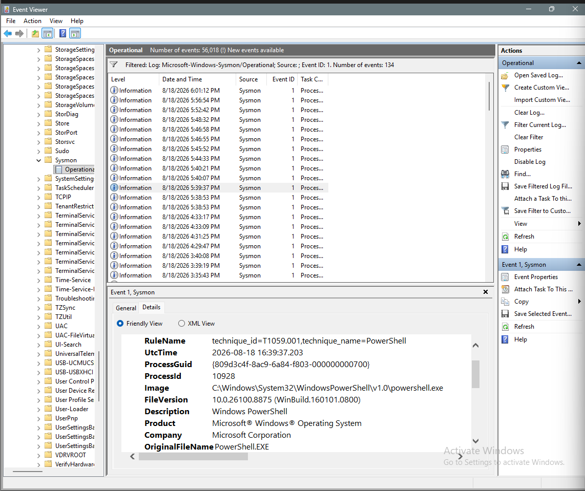
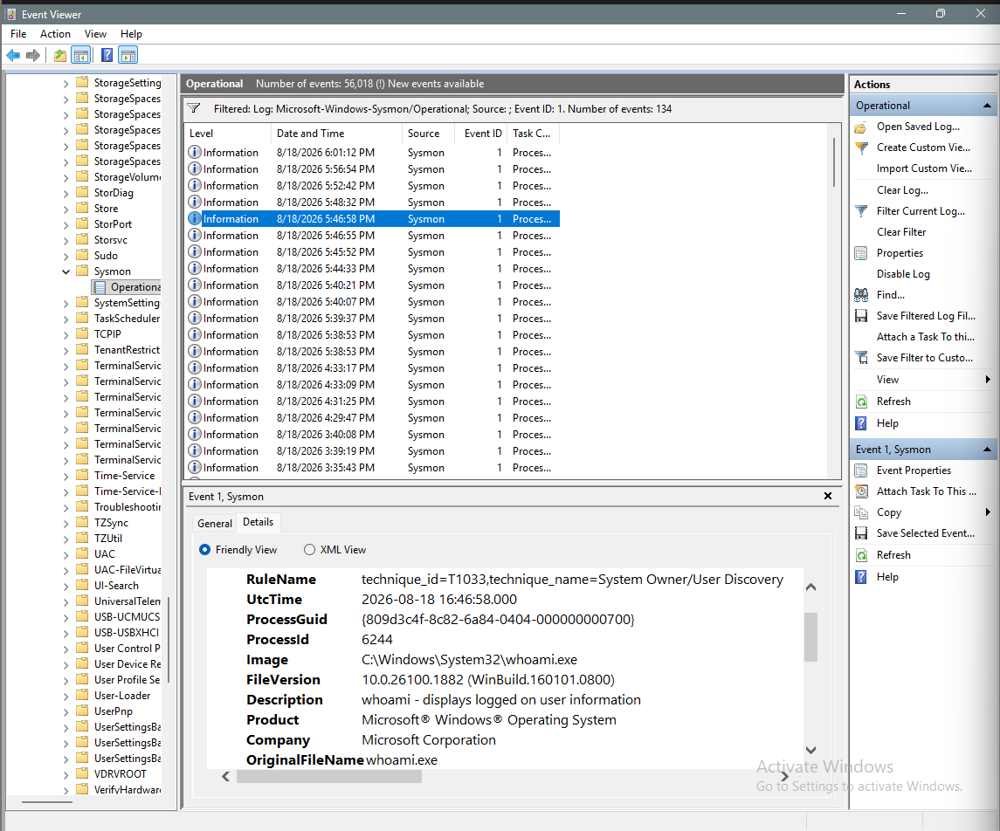
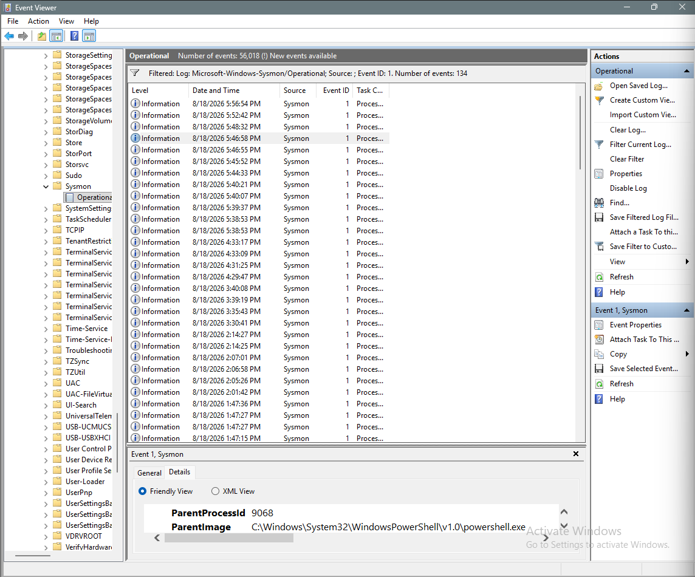

# 🛡️ Sysmon SOC Investigation Lab

A hands-on SOC investigation lab demonstrating how Windows Sysmon telemetry can be used to investigate suspicious PowerShell activity, system discovery, and process relationships.

---

## 🎯 Objective

The objective of this lab was to simulate and investigate suspicious Windows activity using:

- Windows 11
- Sysmon
- Windows Event Viewer
- PowerShell
- MITRE ATT&CK

The investigation follows a basic SOC workflow:

**Alert → Evidence Collection → Process Analysis → MITRE Mapping → Analyst Assessment**

---

## 🔍 Investigation Scenario

A suspicious PowerShell execution was generated inside a controlled Windows 11 virtual machine.

The investigation focused on identifying:

1. Suspicious PowerShell execution
2. PowerShell command-line activity
3. System owner/user discovery
4. Parent-child process relationships
5. Relevant MITRE ATT&CK techniques

---

## 🧰 Tools & Technologies

| Tool | Purpose |
|---|---|
| Windows 11 | Investigation environment |
| Sysmon | Process and system telemetry |
| Event Viewer | Log analysis |
| PowerShell | Simulated activity |
| MITRE ATT&CK | Technique mapping |
| VirtualBox | Isolated lab environment |

---

## 📊 Sysmon Investigation

### 1. PowerShell Execution

Sysmon Event ID 1 was used to identify PowerShell process creation and command-line activity.

**MITRE ATT&CK:** `T1059.001 — PowerShell`

---

### 2. System Owner/User Discovery

A `whoami.exe` process was observed through Sysmon Event ID 1.

**MITRE ATT&CK:** `T1033 — System Owner/User Discovery`

---

### 3. Process Relationship Analysis

Parent and child process information was examined to understand the execution chain and establish process relationships.

---

## 🧠 Investigation Findings

The investigation identified multiple behaviors relevant to SOC monitoring:

- PowerShell process execution
- PowerShell command-line activity
- System owner/user discovery
- Parent-child process relationships
- MITRE ATT&CK technique mapping

Detailed findings are documented in:

- [`Incident Summary`](investigation/incident-summary.md)
- [`Timeline`](investigation/timeline.md)
- [`Findings`](investigation/findings.md)

---

## 🗺️ MITRE ATT&CK Mapping

| Technique | ID | Observed Activity |
|---|---|---|
| PowerShell | T1059.001 | PowerShell execution |
| System Owner/User Discovery | T1033 | `whoami.exe` execution |

---

## 🚨 SOC Analyst Assessment

The observed behavior contains activity that can be associated with command execution and host discovery.

In a real SOC environment, the combination of PowerShell execution and system discovery would warrant further investigation and correlation with additional telemetry such as:

- Windows Security logs
- Network connections
- Authentication events
- Additional Sysmon events
- Endpoint detection telemetry

This lab activity was intentionally generated inside a controlled virtual machine and should not be interpreted as evidence of a real compromise.

---

## 📚 Key Skills Demonstrated

- Windows Event Log Analysis
- Sysmon Event ID 1 Analysis
- PowerShell Investigation
- Process Tree Analysis
- Command-Line Analysis
- MITRE ATT&CK Mapping
- SOC Investigation Workflow
- Security Documentation
- Incident Analysis

---

## 🏁 Conclusion

This lab demonstrates a practical SOC investigation workflow using Windows Sysmon telemetry.

The investigation progressed from identifying suspicious process activity to analyzing execution context, identifying system discovery behavior, mapping techniques to MITRE ATT&CK, and documenting the final findings.

> **Environment:** Windows 11 Virtual Machine  
> **Investigation Type:** Simulated SOC Investigation  
> **Telemetry Source:** Windows Sysmon
